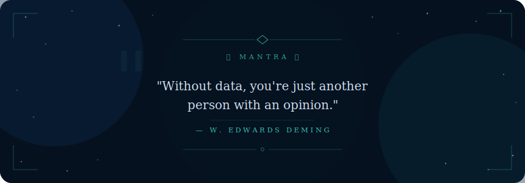

  

  &nbsp;&nbsp;&nbsp;&nbsp;
  &nbsp;&nbsp;&nbsp;&nbsp;
  &nbsp;&nbsp;&nbsp;&nbsp;
  

&nbsp;&nbsp;

---

  
## `</> Who I Am`

---

## 🟢 Open to Work

| 🚀 **Targeting** | Data Analyst • BI Developer • Business Intelligence & Strategy |
| :--- | :--- |
| 🛠️ **Core Skills** | Python • SQL • Power BI • Tableau • Alteryx • Excel |
| 📍 **Location** | Remote • Hybrid • Open to Relocation |
| 🎓 **Education** | B.Tech Information Technology — Final Year |
| ⚡ **Status** | **[Available Immediately]** |
| 📫 **Connect** | &nbsp; &nbsp;&nbsp; &nbsp; |

---

## 🏆 National-Level Achievements

| | Competition | Venue | Highlight |
|---|---|---|---|
| 🥇 | **NEC 2025 — National Entrepreneurship Challenge** | IIT Bombay | Top Finalist (Rank 5) |
| 🥈 | **SIH 2024 — Smart India Hackathon** | IIT Bhubaneswar | Finalist (Blockchain Crypto Tracing) |

---

## 💼 What I Bring to the Team

### 📊 Skills at a Glance

  

---

### 🔄 Data Workflow Pipeline

---

## ⚡ Skill Arsenal

### Core Stack

| Layer | Tools |
|-------|-------|
| **📊 BI & Visualization** |     |
| **🐍 Languages** |    |
| **📦 Python Libraries** |       |
| **🗄️ Databases & Query** |     |
| **🔧 ETL & Workflow** |    |
| **☁️ Cloud & DevOps** |     |

---

## 🏅 Certifications

---

## 📊 Data Analyst Skills Showcase

<table align="left">
  <tr>
    <td align="center">
      
       <b>Data Visualization</b> Built interactive Power BI dashboards
    </td>
    <td align="center">
      
       <b>Exploratory Analysis</b> Uncovered trends using Python
    </td>
    <td align="center">
      
       <b>Data Modeling</b> Structured relational datasets
    </td>
  </tr>
  <tr>
    <td align="center">
      
       <b>Data Cleaning</b> Handled nulls & outliers in Pandas
    </td>
    <td align="center">
      
       <b>Business Intelligence</b> Delivered actionable insights
    </td>
    <td align="center">
      
       <b>SQL Aggregation</b> Wrote complex queries & subqueries
    </td>
  </tr>
</table>
 

---

## 📈 GitHub Activity

---

### 💬 Mantra

  

  

**Let's connect** — I'm actively looking for **Data Analyst** & **BI Developer** opportunities.

 

