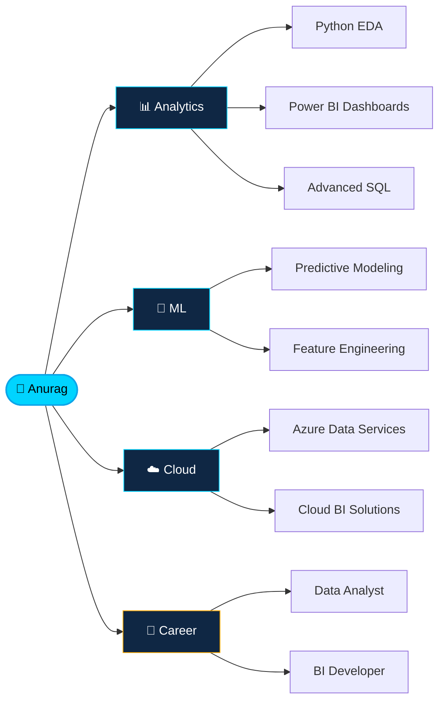

<div align="center">


</div>

<div align="center">

<a href="https://git.io/typing-svg">
  
</a>


<p align="center">
  <a href="https://www.linkedin.com/in/anurag-aditya-soc">
    
  </a>&nbsp;&nbsp;&nbsp;&nbsp;&nbsp;&nbsp;
  <a href="https://intelhawk-portfolio.me">
    
  </a>&nbsp;&nbsp;&nbsp;&nbsp;&nbsp;&nbsp;
  <a href="https://www.novypro.com/profile_about/1770459764895x142560753304924020ull">
    
  </a>&nbsp;&nbsp;&nbsp;&nbsp;&nbsp;&nbsp;
  <a href="https://github.com/Acelake123">
    
  </a>
</p>

</div>

---

## `</> System.Profile`

```python
class DataAnalyst:
    def __init__(self):
        self.name = "Anurag Aditya"
        self.education = "B.Tech Information Technology (Final Year)"
        self.roles = ["Data Analyst", "BI Developer"]
        
        self.superpowers = {
            "Analysis": ["EDA", "Statistical Modeling", "SQL"],
            "Visualization": ["Power BI", "Tableau", "Data Storytelling"]
        }
        
        self.achievements = [
            "🏆 NEC 2025 Finalist — IIT Bombay",
            "🏆 SIH 2024 Finalist — IIT Bhubaneswar"
        ]

    def get_current_status(self):
        return "🟢 Open to Internships & Entry-Level DA/BI Roles"

    def execute_workflow(self, data):
        insights = self.analyze(data)
        decisions = self.visualize(insights)
        return "Impact Driven!" # Data → Insights → Decisions → Impact

me = DataAnalyst()
```

---

## 🏆 National-Level Achievements

<div align="center">

| | Competition | Venue | Highlight |
|---|---|---|---|
| 🥇 | **NEC 2025 — National Entrepreneurship Challenge** | IIT Bombay | Top Finalist |
| 🥈 | **SIH 2024 — Smart India Hackathon** | IIT Bhubaneswar | Blockchain Crypto Tracing |

</div>

---

## ⚙️ Analytical Pipeline

```mermaid
flowchart LR
    subgraph I ["&nbsp;📥 &nbsp;01 · INGEST&nbsp;"]
        I1("🔧 Data Wrangling")
        I2("🚫 Null Handling")
        I3("📐 Outlier Fix")
        I4("🐼 Pandas Pipeline")
    end

    subgraph A ["&nbsp;🧠 &nbsp;02 · ANALYZE&nbsp;"]
        A1("📈 EDA & Stats")
        A2("🔍 Trend Mining")
        A3("🗄️ SQL Queries")
        A4("🐍 Python Scripts")
    end

    subgraph V ["&nbsp;📊 &nbsp;03 · VISUALIZE&nbsp;"]
        V1("⚡ Power BI Dash")
        V2("📉 Tableau Story")
        V3("💡 Business Recs")
        V4("📝 Exec Summaries")
    end

    subgraph D ["&nbsp;🚀 &nbsp;04 · IMPACT&nbsp;"]
        D1("🤝 Stakeholders")
        D2("🎯 Strategy Input")
        D3("📌 KPI Tracking")
        D4("✅ Action Insights")
    end

    I ===>|"clean"| A
    A ===>|"model"| V
    V ===>|"present"| D

    style I fill:#0d1b2e,stroke:#38bdf8,stroke-width:2px,color:#e2e8f0
    style A fill:#0d1b2e,stroke:#a78bfa,stroke-width:2px,color:#e2e8f0
    style V fill:#0d1b2e,stroke:#34d399,stroke-width:2px,color:#e2e8f0
    style D fill:#0d1b2e,stroke:#fb923c,stroke-width:2px,color:#e2e8f0

    style I1 fill:#0c2340,stroke:#38bdf8,stroke-width:1px,color:#94d8ff
    style I2 fill:#0c2340,stroke:#38bdf8,stroke-width:1px,color:#94d8ff
    style I3 fill:#0c2340,stroke:#38bdf8,stroke-width:1px,color:#94d8ff
    style I4 fill:#0c2340,stroke:#38bdf8,stroke-width:1px,color:#94d8ff

    style A1 fill:#1e1040,stroke:#a78bfa,stroke-width:1px,color:#c4b5fd
    style A2 fill:#1e1040,stroke:#a78bfa,stroke-width:1px,color:#c4b5fd
    style A3 fill:#1e1040,stroke:#a78bfa,stroke-width:1px,color:#c4b5fd
    style A4 fill:#1e1040,stroke:#a78bfa,stroke-width:1px,color:#c4b5fd

    style V1 fill:#0d2e22,stroke:#34d399,stroke-width:1px,color:#6ee7b7
    style V2 fill:#0d2e22,stroke:#34d399,stroke-width:1px,color:#6ee7b7
    style V3 fill:#0d2e22,stroke:#34d399,stroke-width:1px,color:#6ee7b7
    style V4 fill:#0d2e22,stroke:#34d399,stroke-width:1px,color:#6ee7b7

    style D1 fill:#2e1808,stroke:#fb923c,stroke-width:1px,color:#fdba74
    style D2 fill:#2e1808,stroke:#fb923c,stroke-width:1px,color:#fdba74
    style D3 fill:#2e1808,stroke:#fb923c,stroke-width:1px,color:#fdba74
    style D4 fill:#2e1808,stroke:#fb923c,stroke-width:1px,color:#fdba74
```



---

## ⚡ Skill Arsenal

<div align="center">

### Core Stack

| Layer | Tools |
|-------|-------|
| **📊 BI & Visualization** |    |
| **🐍 Languages** |     |
| **📦 Python Libraries** |      |
| **🗄️ Databases & Query** |    |
| **🔧 ETL & Workflow** |   |
| **☁️ Cloud & DevOps** |    |

</div>

---

## 🏅 Certifications

<div align="center">

<table>
<tr>
  <td align="center">
    
    <br/><b>IBM</b><br/><sub>Professional Data Science</sub>
  </td>
  <td align="center">
    
    <br/><b>Google</b><br/><sub>Data Analytics</sub>
  </td>
  <td align="center">
    
    <br/><b>IBM</b><br/><sub>Applied Data Science · Python</sub>
  </td>
  <td align="center">
    
    <br/><b>IBM</b><br/><sub>Data Science for Business</sub>
  </td>
</tr>
<tr>
  <td align="center">
    
    <br/><b>IBM</b><br/><sub>Data Science Foundations</sub>
  </td>
  <td align="center">
    
    <br/><b>IBM</b><br/><sub>Data Analysis · Python</sub>
  </td>
  <td align="center">
    
    <br/><b>IBM</b><br/><sub>Data Science Methodologies</sub>
  </td>
  <td align="center">
    
    <br/><b>IBM</b><br/><sub>Data Visualization · Python</sub>
  </td>
</tr>
</table>

</div>

---

## 📈 GitHub Activity

<div align="center">


</div>

---

## 🎯 Current Focus



---

<h2 align="center"> 📊 Data Analyst Skills Showcase</h2>

<table align="center">
  <tr>
    <td align="center">
      
      <br><b>Data Visualization</b><br>Built interactive Power BI dashboards
    </td>
    <td align="center">
      
      <br><b>Exploratory Analysis</b><br>Uncovered trends using Python
    </td>
    <td align="center">
      
      <br><b>Data Modeling</b><br>Structured relational datasets
    </td>
  </tr>
  <tr>
    <td align="center">
      
      <br><b>Data Cleaning</b><br>Handled nulls & outliers in Pandas
    </td>
    <td align="center">
      
      <br><b>Business Intelligence</b><br>Delivered actionable insights
    </td>
    <td align="center">
      
      <br><b>SQL Aggregation</b><br>Wrote complex queries & subqueries
    </td>
  </tr>
</table>

---

<div align="center">

### 💬 Mantra

> *"Without data, you're just another person with an opinion."*
> — **W. Edwards Deming**

<br/>


<br/>

---

**Let's connect — I'm actively looking for Data Analyst & BI Developer opportunities.**

[](https://www.linkedin.com/in/anurag-aditya-soc)

</div>


